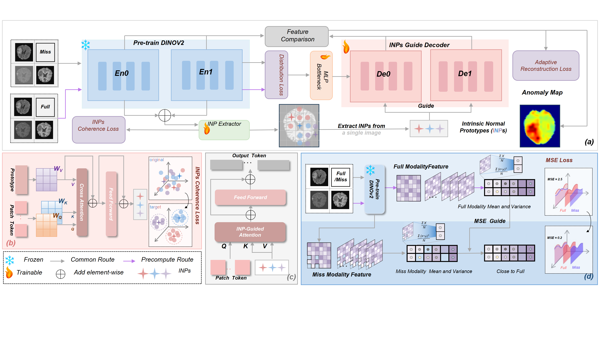
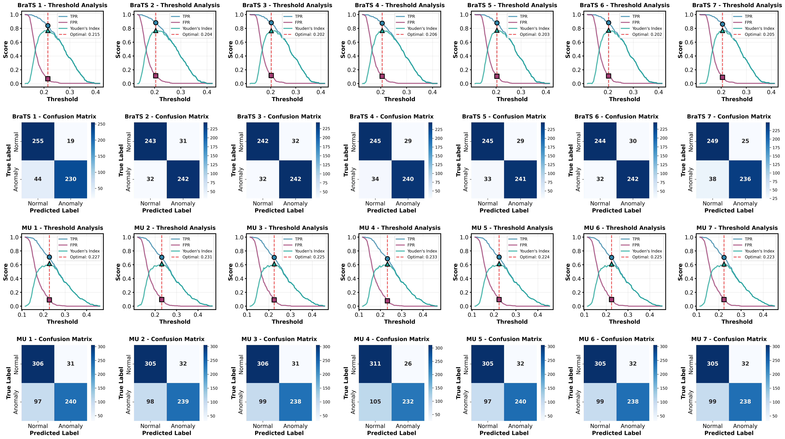

# AnyAD: Unified Any-Modality Anomaly Detection in Incomplete Multi-Sequence MRI

&gt; **AnyAD** is a unified anomaly detection framework that handles **arbitrary modality combinations** in **multi-sequence MRI**, especially when **modalities are missing**.  
&gt; **No retraining** is required—it delivers **robust anomaly detection and localization** under **any input configuration**.

---

## 🔍 Overview

In real clinical practice, MRI sequences (e.g., T1, T2, FLAIR) are often **partially missing** due to equipment limitations, cost constraints, or patient factors. Existing methods typically assume **fixed modality inputs**, limiting their usability in **incomplete-modality scenarios**.

**AnyAD** introduces the **Any-Modality Anomaly Detection (Any-Modality AD)** paradigm, offering:

- ✅ Support for **any number and type** of MRI modalities (e.g., T1 only, T2+FLAIR, single FLAIR, etc.)
- ✅ **One-time training** with **shared weights**—no need to retrain for each modality combination
- ✅ **High-performance anomaly detection and localization** even with **severe modality dropout**
- ✅ **Strong generalization** across institutions and diseases

---

## 🧠 Model Architecture

AnyAD consists of three core modules:

### 1. Dual-Pathway DINOv2 Encoder
- Uses **DINOv2 ViT-Base** to extract multi-scale features
- Splits into **deep** and **shallow** pathways for **anomaly contrast** and **reconstruction**, respectively

### 2. Feature Distribution Alignment
- Pre-computes **full-modality feature statistics** (mean/variance) before training
- During training, applies **MSE-based distribution alignment loss** to align **missing-modality features** with **full-modality references**, reducing feature shift

### 3. INP-Former Guided Reconstruction
- **INPs (Intrinsic Normal Prototypes) extractor** learns representative normal patterns from healthy samples
- **INP-guided decoder** reconstructs only normal structures—anomalies are highlighted by **reconstruction error**

---

## 🎯 Key Contributions

| Contribution | Description |
|--------------|-------------|
| **Unified Framework** | First AD method supporting **arbitrary modality combinations** without retraining |
| **Distribution Alignment Loss** | Aligns **missing-modality features** to **full-modality space**, improving robustness |
| **INP-Former Enhancement** | Uses **normal prototypes** to guide reconstruction, enhancing anomaly contrast |
| **Indirect Feature Completion** | Learns **implicit modality compensation** via random modality masking during training |
| **Cross-Domain Generalization** | Evaluated on **BraTS2018**, **MU-Glioma-Post**, and **Pretreat-MetsToBrain-Masks**—shows strong **cross-institution/disease** transferability |

---

## 📊 Experimental Results

### ✅ Main Results on BraTS2018

| Method           | AUROC (Image/Pixel) | AP (Image/Pixel)    | F1 (Image/Pixel)    | AUPRO      |
| ---------------- | ------------------- | ------------------- | ------------------- | ---------- |
| STFPM            | 0.7349 / 0.9480     | 0.7006 / 0.1848     | 0.7360 / 0.2779     | 0.7587     |
| RD4AD            | 0.8114 / 0.9689     | 0.7983 / 0.3894     | 0.7107 / 0.3520     | 0.7483     |
| AE-Flow          | 0.7231 / 0.8573     | 0.7128 / 0.0601     | 0.7193 / 0.1108     | 0.5220     |
| DAE              | 0.8087 / 0.9415     | 0.8115 / 0.2788     | 0.7505 / 0.3479     | 0.5639     |
| ReContrast       | 0.8752 / 0.9757     | 0.8677 / 0.5369     | 0.8197 / 0.5762     | 0.8123     |
| GatingAno        | 0.6771 / 0.7865     | 0.6995 / 0.0674     | 0.7123 / 0.1306     | 0.5456     |
| skipTS           | 0.8360 / 0.9716     | 0.8155 / 0.3830     | 0.8256 / 0.4414     | 0.7346     |
| ESCK-DRKD        | 0.7459 / 0.8707     | 0.7293 / 0.0594     | 0.7275 / 0.1245     | 0.5655     |
| MMRAD            | 0.7287 / 0.8698     | 0.7475 / 0.0848     | 0.6950 / 0.1551     | 0.5364     |
| INPFormer        | 0.9376 / 0.9889     | 0.9358 / 0.7510     | 0.8674 / 0.6985     | 0.8501     |
| **AnyAD (Ours)** | **0.9473 / 0.9922** | **0.9454 / 0.7881** | **0.8862 / 0.7351** | **0.8760** |

| Method | Image-Level AUROC | Pixel-Level AUROC | AUPRO |
|--------|--------------------|--------------------|--------|
| INP-Former | 0.9376 | 0.9889 | 0.8501 |
| **AnyAD (Ours)** | **0.9473** | **0.9922** | **0.8760** |

&gt; Outperforms state-of-the-art methods across **7 modality combinations**, with **1–3% average improvement**

### ✅ Cross-Domain Generalization

| Metrics     | AUROC (I/P)         | AP (I/P)            | F1 (I/P)            | AUPRO      |
| ----------- | ------------------- | ------------------- | ------------------- | ---------- |
| **F+T1+T2** | 0.8611 / 0.9839     | 0.8881 / 0.6352     | 0.7779 / 0.6173     | 0.8355     |
| **F+T1**    | 0.8584 / 0.9835     | 0.8844 / 0.6297     | 0.7745 / 0.6123     | 0.8328     |
| **F+T2**    | 0.8609 / 0.9837     | 0.8872 / 0.6328     | 0.7776 / 0.6155     | 0.8349     |
| **T1+T2**   | 0.8620 / 0.9841     | 0.8889 / 0.6372     | 0.7787 / 0.6189     | 0.8368     |
| **FLAIR**       | 0.8599 / 0.9836     | 0.8865 / 0.6307     | 0.7774 / 0.6140     | 0.8348     |
| **T1**      | 0.8580 / 0.9837     | 0.8842 / 0.6331     | 0.7730 / 0.6146     | 0.8332     |
| **T2**      | 0.8635 / 0.9845     | 0.8909 / 0.6411     | 0.7816 / 0.6223     | 0.8381     |
| **Average** | **0.8606 / 0.9838** | **0.8869 / 0.6343** | **0.7770 / 0.6164** | **0.8350** |

### ✅ Zero-Shot

| Dataset            | AUROC (Img/Pix) | AP (Img/Pix)    | F1 (Img/Pix)    | AUPRO  |
| ------------------ | --------------- | --------------- | --------------- | ------ |
| **BraTS2018**      | 0.8618 / 0.9666 | 0.8942 / 0.5559 | 0.7830 / 0.5286 | 0.7707 |
| **MU**             | 0.7700 / 0.9666 | 0.8226 / 0.4731 | 0.7068 / 0.4537 | 0.7910 |
| **BraTS→Pretreat** | 0.7122 / 0.9403 | 0.7351 / 0.3059 | 0.6869 / 0.3390 | 0.7453 |
| **MU→Pretreat**    | 0.7315 / 0.9591 | 0.7648 / 0.3523 | 0.6922 / 0.3647 | 0.7664 |

&gt; **No fine-tuning** required—**direct transfer** to unseen brain metastasis MRI with stable performance

---
